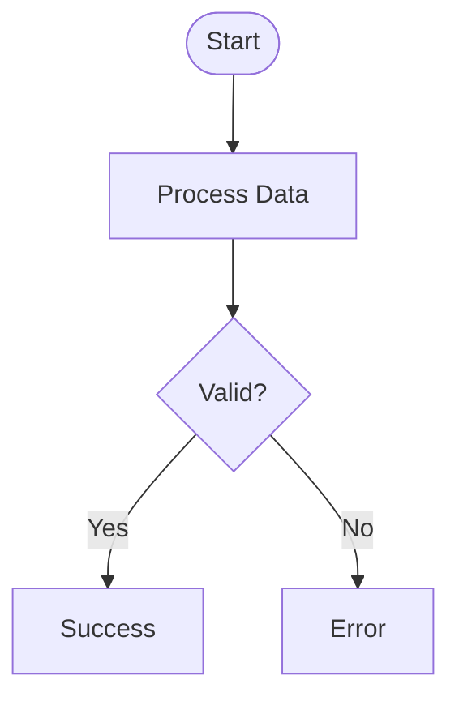
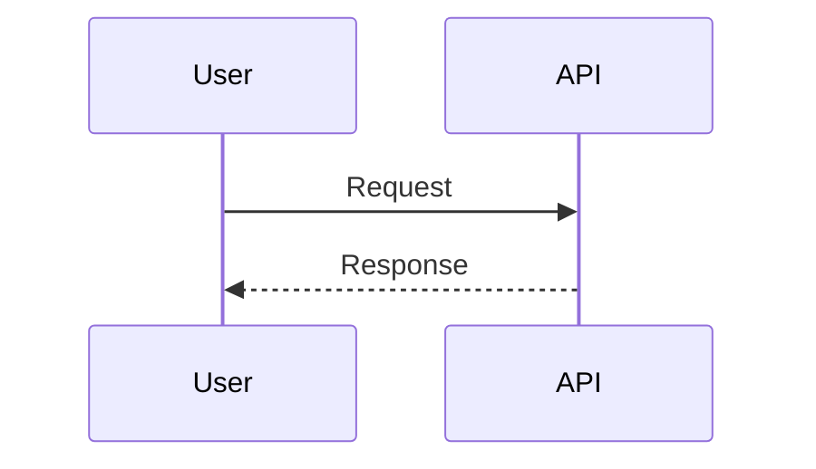
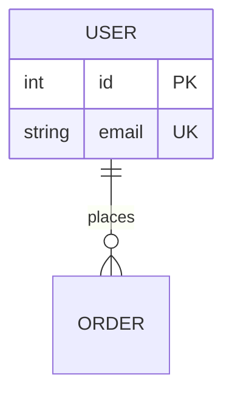
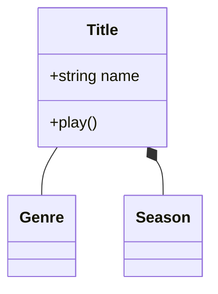

# Mermaid Diagrams

Create professional software diagrams using Mermaid's text-based syntax. Diagrams are version-controllable, easy to update, and render automatically in GitHub, GitLab, Notion, and most markdown viewers.

## Quick Workflow

1. **Select diagram type** using decision matrix below
2. **Start with core elements** - entities, actors, or components
3. **Add relationships** - connections, flows, interactions
4. **Validate** - check syntax, completeness, clarity
5. **Style** (optional) - apply themes or custom styling

## Diagram Type Selection

Use this decision matrix to choose the right diagram type:

| Need to Show | Diagram Type | Reference File |
|--------------|--------------|----------------|
| Process with decisions | Flowchart | [flowcharts.md](references/flowcharts.md) |
| API/system interactions | Sequence Diagram | [sequence-diagrams.md](references/sequence-diagrams.md) |
| Database structure | ERD | [erd-diagrams.md](references/erd-diagrams.md) |
| Object relationships | Class Diagram | [class-diagrams.md](references/class-diagrams.md) |
| System architecture | C4 Diagram | [c4-diagrams.md](references/c4-diagrams.md) |
| State transitions | State Diagram | [state-diagrams.md](references/state-diagrams.md) |
| Project timeline | Gantt Chart | [gantt-charts.md](references/gantt-charts.md) |
| Version control flow | Git Graph | [git-graphs.md](references/git-graphs.md) |
| Data visualization | Pie/Bar Chart | [charts.md](references/charts.md) |

## Core Syntax Pattern

All Mermaid diagrams follow this pattern:

```mermaid
diagramType
  definition content
```

**Key principles:**
- First line declares diagram type (e.g., `classDiagram`, `sequenceDiagram`, `flowchart`)
- Use `%%` for comments
- Line breaks improve readability but aren't required
- Unknown words break diagrams; parameters fail silently

## Quick Examples

### Flowchart


### Sequence Diagram


### ERD


### Class Diagram


## Validation Checklist

Before finalizing a diagram, verify:

- [ ] Diagram type matches content and purpose
- [ ] All entities/components/actors identified
- [ ] Relationships/connections are accurate
- [ ] Syntax is valid (test in [Mermaid Live](https://mermaid.live))
- [ ] Labels are clear and descriptive
- [ ] Flow direction is logical
- [ ] All paths/outcomes are covered (for flowcharts)
- [ ] Start and end states defined (where applicable)

## Common Patterns

See [workflows.md](workflows.md) for step-by-step workflows and [examples.md](examples.md) for common patterns including:
- API request flows
- Authentication sequences
- Error handling flows
- Database schema design
- Architecture documentation

## Styling and Theming

Apply themes and custom styling. See [advanced-features.md](references/advanced-features.md) for:
- Built-in themes (default, forest, dark, neutral, base)
- Custom color schemes
- Node styling
- Layout options

## Detailed References

For comprehensive syntax and advanced features:

- **[flowcharts.md](references/flowcharts.md)** - Node shapes, decision logic, subgraphs
- **[sequence-diagrams.md](references/sequence-diagrams.md)** - Actors, messages, activations, alt/loop blocks
- **[erd-diagrams.md](references/erd-diagrams.md)** - Entities, relationships, cardinality, keys
- **[class-diagrams.md](references/class-diagrams.md)** - Relationships, multiplicity, methods/properties
- **[c4-diagrams.md](references/c4-diagrams.md)** - Context, container, component levels
- **[state-diagrams.md](references/state-diagrams.md)** - States, transitions, lifecycle
- **[gantt-charts.md](references/gantt-charts.md)** - Tasks, dependencies, timelines
- **[git-graphs.md](references/git-graphs.md)** - Branches, commits, merges
- **[charts.md](references/charts.md)** - Pie charts, bar charts, data visualization
- **[advanced-features.md](references/advanced-features.md)** - Themes, styling, configuration

## Best Practices

1. **Start simple** - Begin with core elements, add complexity incrementally
2. **One diagram, one concept** - Keep focused; split large views into multiple diagrams
3. **Use meaningful names** - Clear labels make diagrams self-documenting
4. **Comment liberally** - Use `%%` to explain non-obvious relationships
5. **Version control** - Store `.mmd` files with code, update as system evolves
6. **Validate syntax** - Test in Mermaid Live before committing
7. **Keep readable** - Don't overcrowd; split if needed (max ~20 nodes recommended)

## Export and Rendering

**Native support:**
- GitHub/GitLab - Automatic rendering in `.md` files
- VS Code - With Markdown Mermaid extension
- Notion, Obsidian, Confluence - Built-in support

**Export options:**
- [Mermaid Live Editor](https://mermaid.live) - Online editor with PNG/SVG export
- Mermaid CLI - `npm install -g @mermaid-js/mermaid-cli` then `mmdc -i input.mmd -o output.png`
