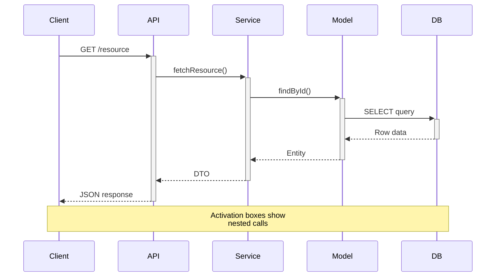
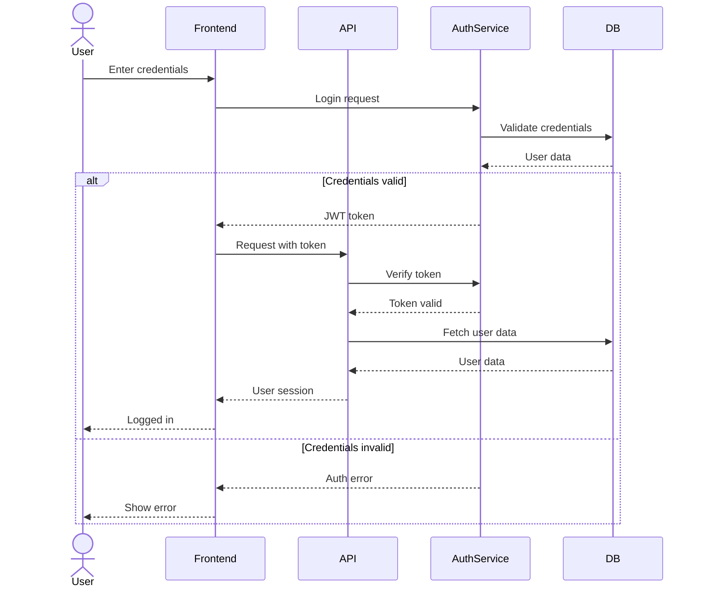
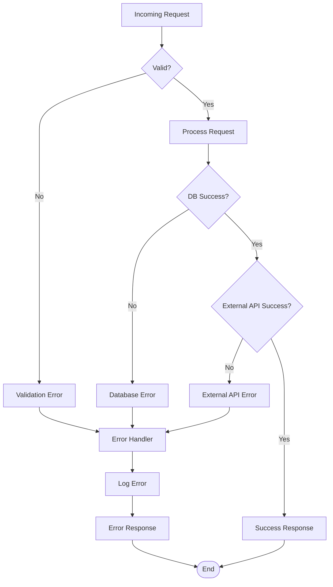
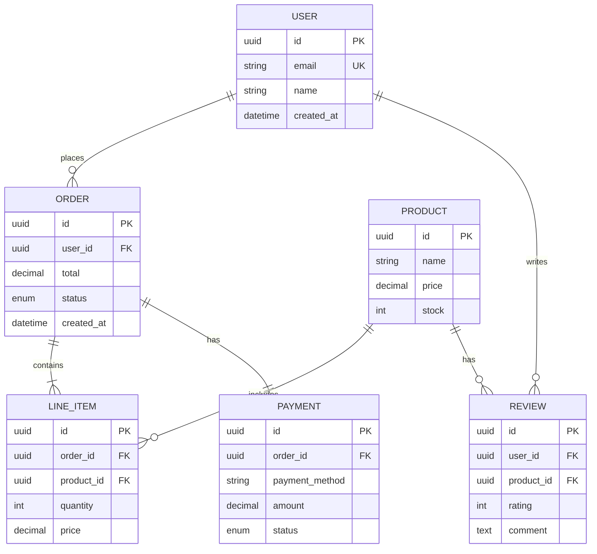
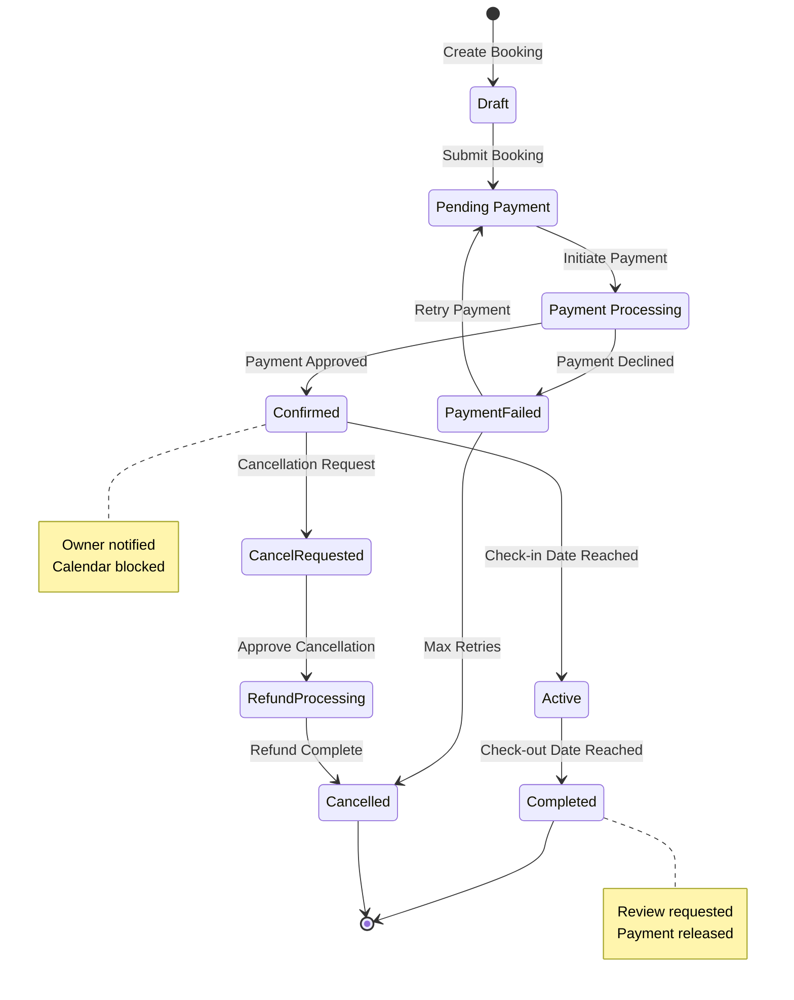
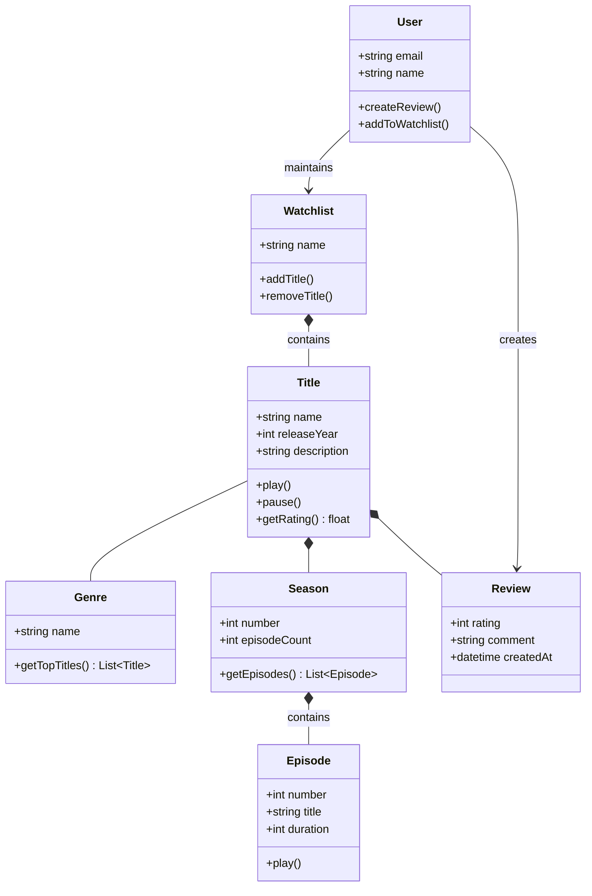
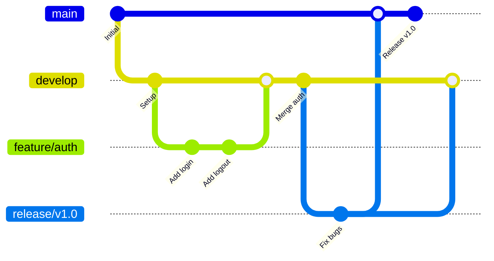
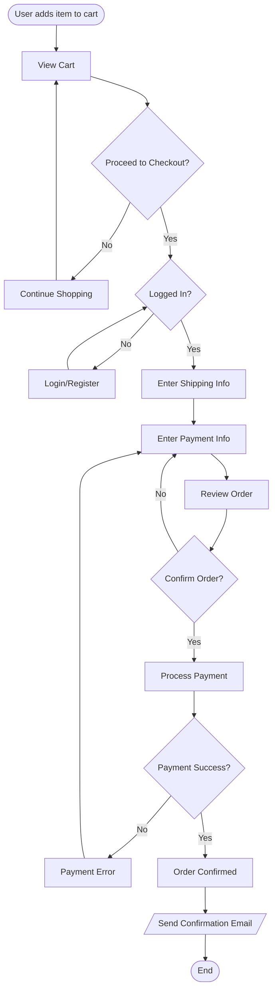
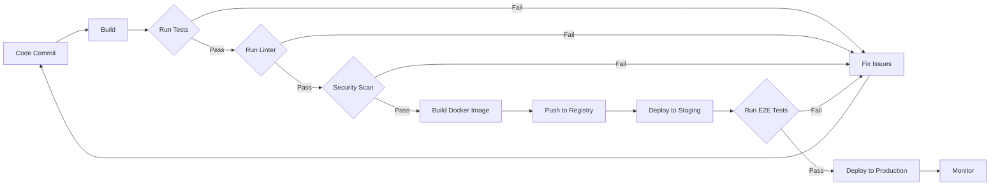

# Common Mermaid Diagram Patterns

Reusable patterns for common software scenarios.

## API Request Flow

Standard request/response pattern with error handling:



## Authentication Flow

Login sequence with token validation:



## Error Handling Flow

Comprehensive error handling in a process:



## Database Schema Pattern

Common e-commerce schema:



## Microservices Architecture (C4 Container)

Container-level view of microservices:

```mermaid
C4Container
    title Container Diagram - E-commerce Platform

    Person(customer, "Customer")

    Container(web, "Web App", "React", "Customer-facing web application")
    Container(api, "API Gateway", "Kong", "Routes requests to services")
    Container(auth, "Auth Service", "Node.js", "Handles authentication")
    Container(catalog, "Catalog Service", "Python", "Product catalog")
    Container(order, "Order Service", "Java", "Order processing")
    ContainerDb(payment_db, "Payment DB", "PostgreSQL", "Payment data")
    ContainerDb(order_db, "Order DB", "PostgreSQL", "Order data")
    ContainerDb(catalog_db, "Catalog DB", "PostgreSQL", "Product data")
    System_Ext(payment_gateway, "Payment Gateway", "External payment processor")

    Rel(customer, web, "Uses", "HTTPS")
    Rel(web, api, "Calls", "HTTPS")
    Rel(api, auth, "Authenticates", "gRPC")
    Rel(api, catalog, "Queries products", "REST")
    Rel(api, order, "Creates orders", "REST")
    Rel(order, payment_gateway, "Processes payments", "HTTPS")
    Rel(auth, auth_db, "Reads/Writes", "SQL")
    Rel(catalog, catalog_db, "Reads/Writes", "SQL")
    Rel(order, order_db, "Reads/Writes", "SQL")
```

## Booking Lifecycle (State Diagram)

Complete booking state machine:



## Domain Model (Class Diagram)

Video streaming platform domain:



## Git Branching Strategy

Feature branch workflow:



## User Journey Flow

E-commerce checkout process:



## Deployment Pipeline

CI/CD workflow:


