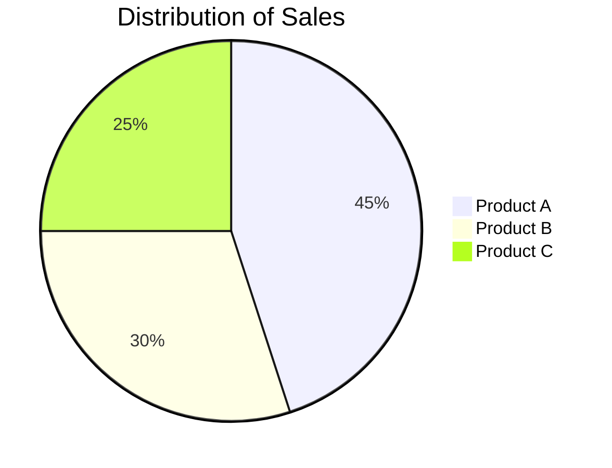
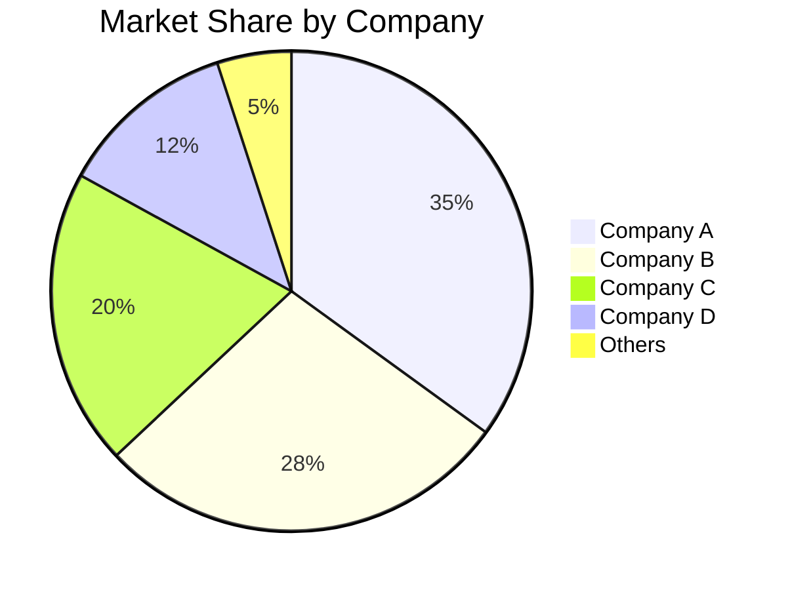
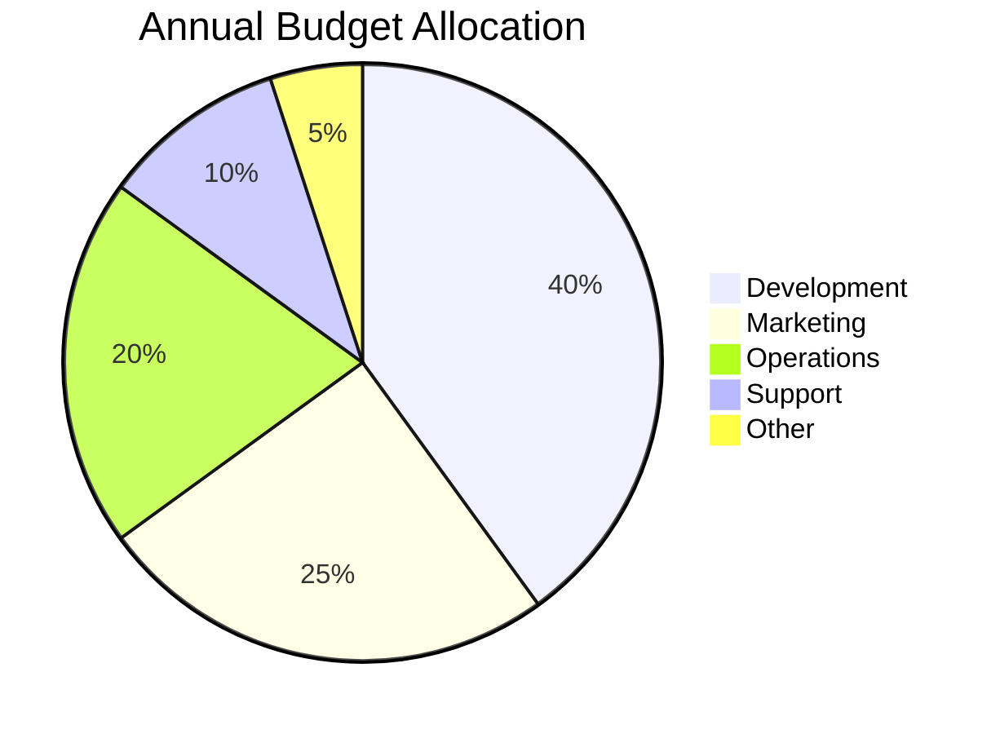
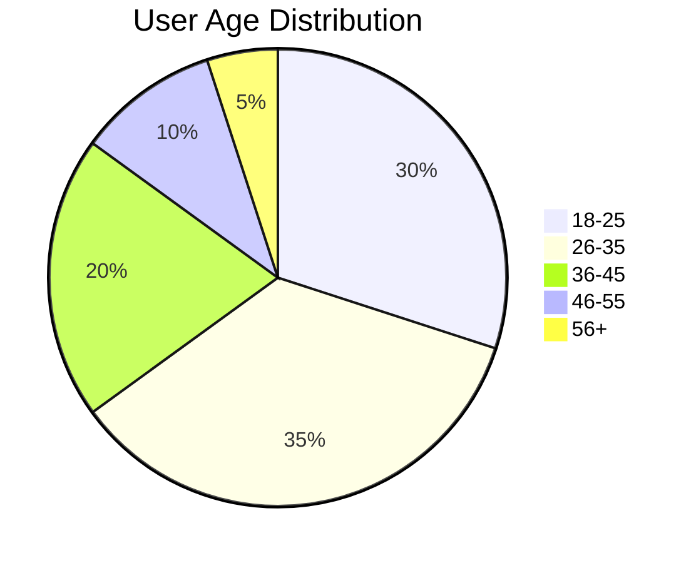
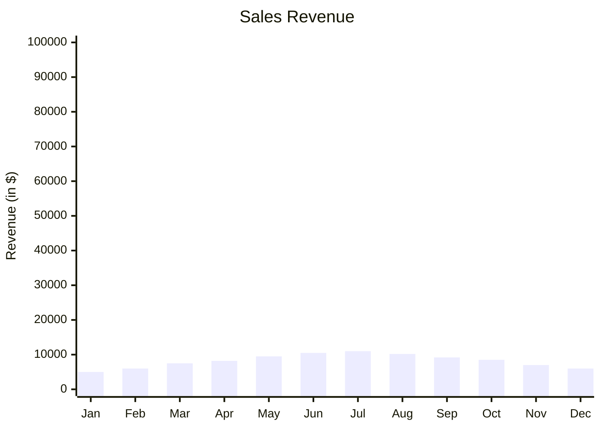
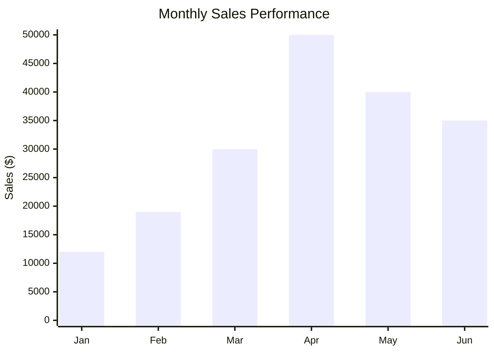

# Charts (Pie and Bar)

Mermaid supports pie charts and bar charts for data visualization.

## Pie Charts

### Basic Syntax

### Example: Market Share

### Example: Budget Allocation

### Example: User Demographics

## Bar Charts

### Basic Syntax

### Example: Monthly Sales

### Example: Comparison Chart

```mermaid
xychart-beta
    title "Product Sales Comparison"
    x-axis [Q1, Q2, Q3, Q4]
    y-axis "Units Sold" 0 --> 1000
    bar [200, 300, 400, 500]
    bar [150, 250, 350, 450]
```

### Example: Multiple Series

```mermaid
xychart-beta
    title "Revenue by Product Category"
    x-axis [2021, 2022, 2023, 2024]
    y-axis "Revenue ($)" 0 --> 200000
    bar [50000, 75000, 100000, 150000]
    bar [30000, 45000, 60000, 90000]
    bar [20000, 30000, 40000, 60000]
```

## Best Practices

1. **Clear titles** - Describe what the chart shows
2. **Appropriate scale** - Set y-axis range appropriately
3. **Meaningful labels** - Use descriptive category names
4. **Consistent units** - Use same units throughout
5. **Limit categories** - Too many slices/bars reduce readability
6. **Order data** - Sort by value for easier comparison

## Common Use Cases

- **Market Analysis** - Market share, competitor analysis
- **Budget Planning** - Budget allocation, spending breakdown
- **Performance Metrics** - Sales trends, user growth
- **Survey Results** - Response distribution, demographics
- **Resource Allocation** - Team distribution, time allocation

## Limitations

- Pie charts: Limited to showing proportions/percentages
- Bar charts: Basic visualization, limited customization
- For complex visualizations, consider exporting to specialized tools
