# Gantt Charts

Gantt charts visualize project timelines, showing tasks, durations, dependencies, and milestones.

## Basic Syntax

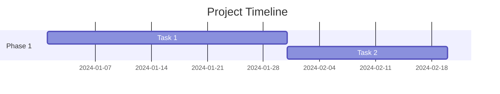

## Date Format

Specify date format:

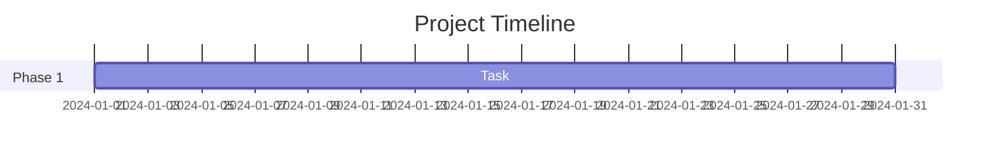

**Common formats:**
- `YYYY-MM-DD` - 2024-01-15
- `MM/DD/YYYY` - 01/15/2024
- `DD-MM-YYYY` - 15-01-2024

## Task Definition

### Basic Task
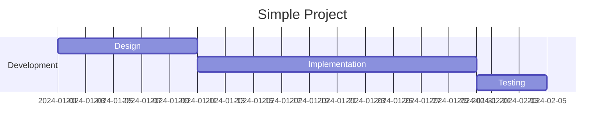

### Task with ID
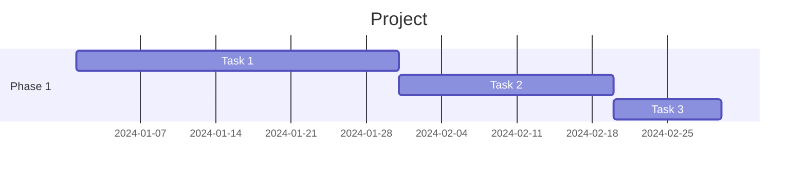

## Dependencies

### After Another Task
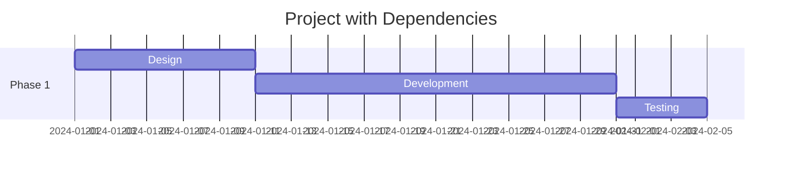

### Multiple Dependencies
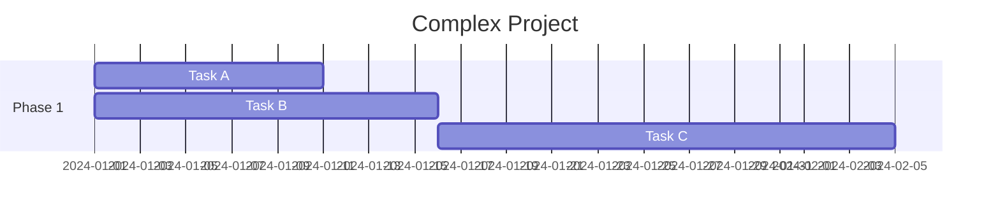

## Task Status

Mark tasks with status:

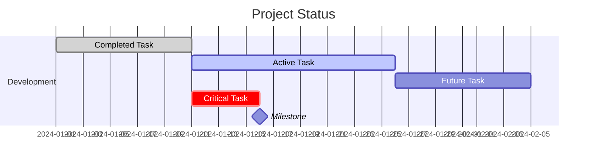

**Status types:**
- `done` - Completed task
- `active` - Currently in progress
- `crit` - Critical path task
- `milestone` - Milestone marker (0 duration)

## Milestones

Mark important dates:

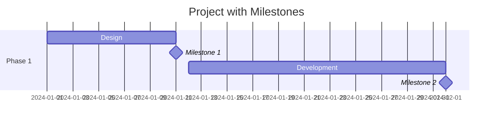

## Sections

Organize tasks into sections:

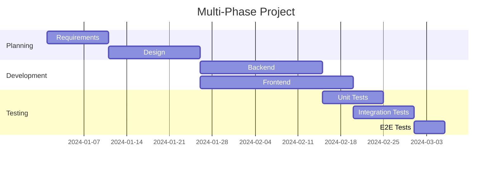

## Comprehensive Example: Software Release

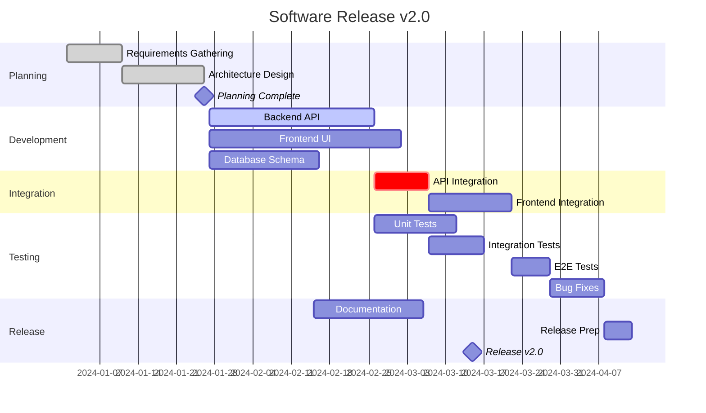

## Task Durations

Specify duration in different units:

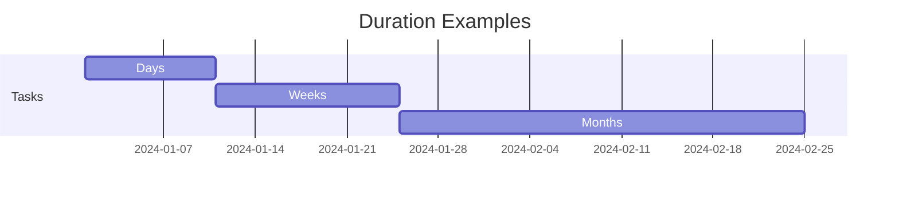

**Duration units:**
- `d` - Days
- `w` - Weeks
- `M` - Months
- `y` - Years

## Best Practices

1. **Use sections** - Group related tasks
2. **Set dependencies** - Show task relationships
3. **Mark milestones** - Highlight key dates
4. **Use status** - Show progress (done, active)
5. **Critical path** - Mark critical tasks with `crit`
6. **Realistic durations** - Base on estimates, not wishes
7. **Update regularly** - Keep charts current

## Common Use Cases

- **Project Planning** - Visualize entire project timeline
- **Sprint Planning** - Show sprint tasks and dependencies
- **Release Planning** - Track release milestones
- **Resource Planning** - Show who works on what when
- **Feature Development** - Track feature from design to release
