# Git Graphs

Git graphs visualize version control branching strategies, commit history, and merge patterns.

## Basic Syntax

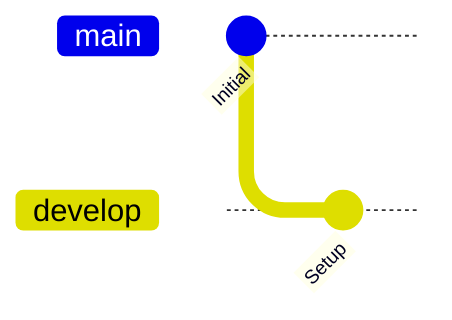

## Commits

### Simple Commits
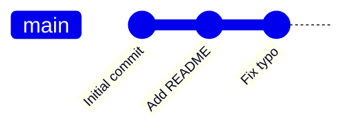

### Commits with Tags
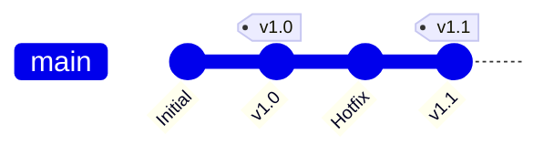

## Branches

### Create and Checkout
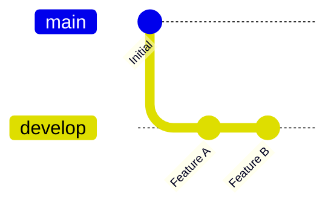

### Multiple Branches
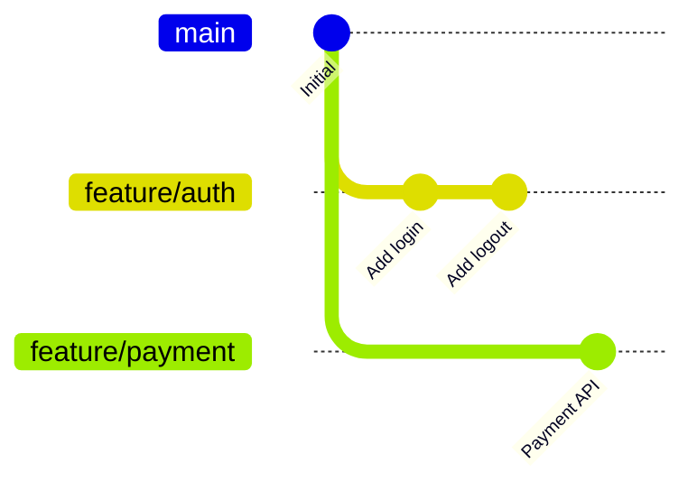

## Merges

### Merge Branch
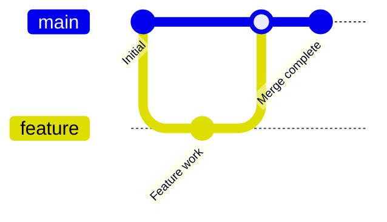

### Merge with Tag
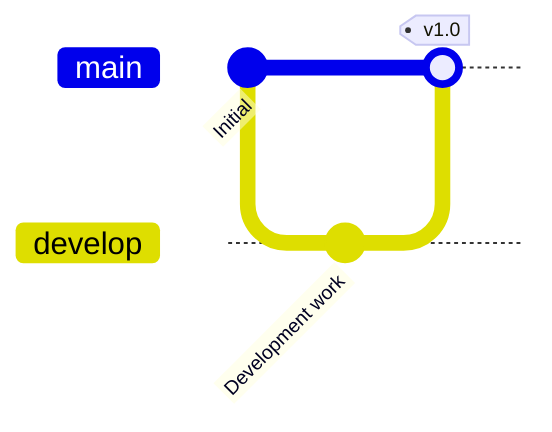

## Common Branching Strategies

### Git Flow
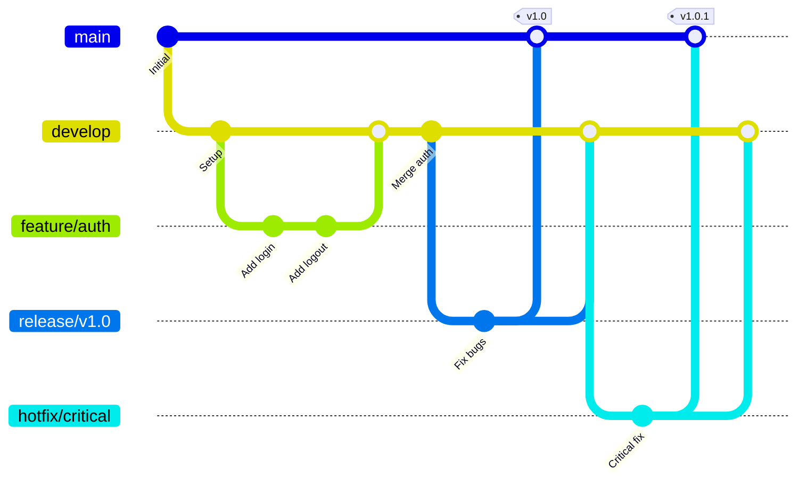

### GitHub Flow
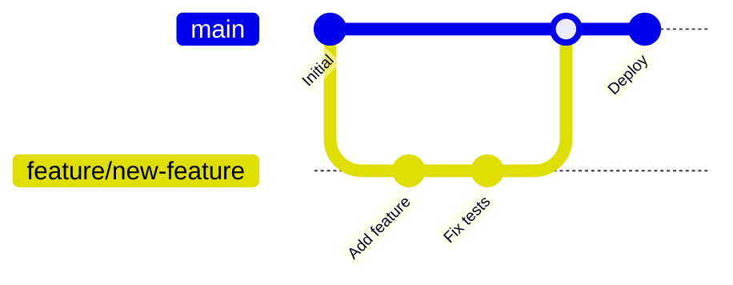

### Trunk-Based Development
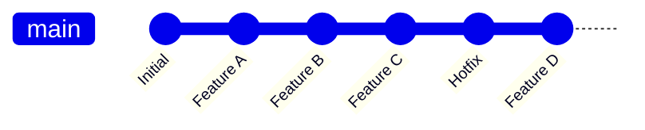

## Feature Branch Workflow

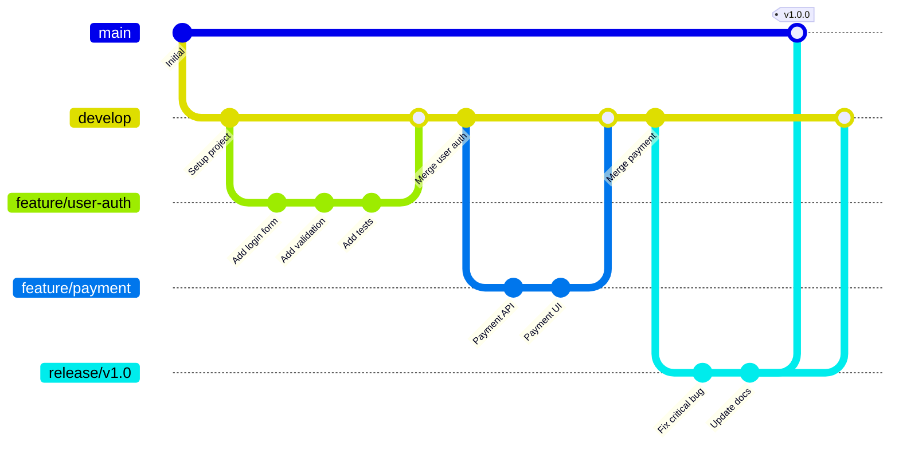

## Release Process

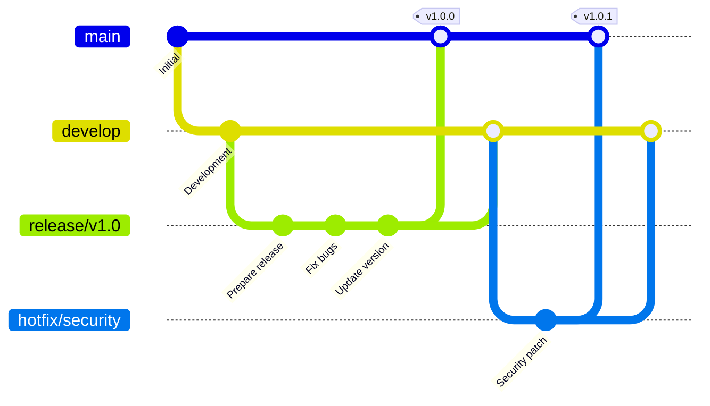

## Best Practices

1. **Clear commit messages** - Use descriptive IDs
2. **Show branch purpose** - Name branches meaningfully
3. **Show merge points** - Indicate when branches merge
4. **Tag releases** - Mark version tags
5. **Show flow** - Demonstrate branching strategy
6. **Keep it simple** - Don't overcrowd with too many branches

## Common Use Cases

- **Document branching strategy** - Show team workflow
- **Explain merge process** - Visualize how features integrate
- **Release planning** - Show release branches and tags
- **Onboarding** - Help new team members understand git flow
- **Code review** - Show where changes come from
