# State Diagrams

State diagrams model state machines and lifecycles. They show how entities transition between states based on events or conditions.

## Basic Syntax

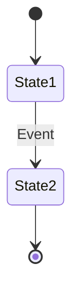

## States

### Simple States
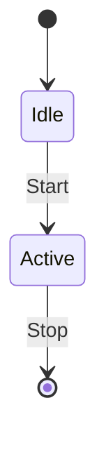

### Named States with Aliases
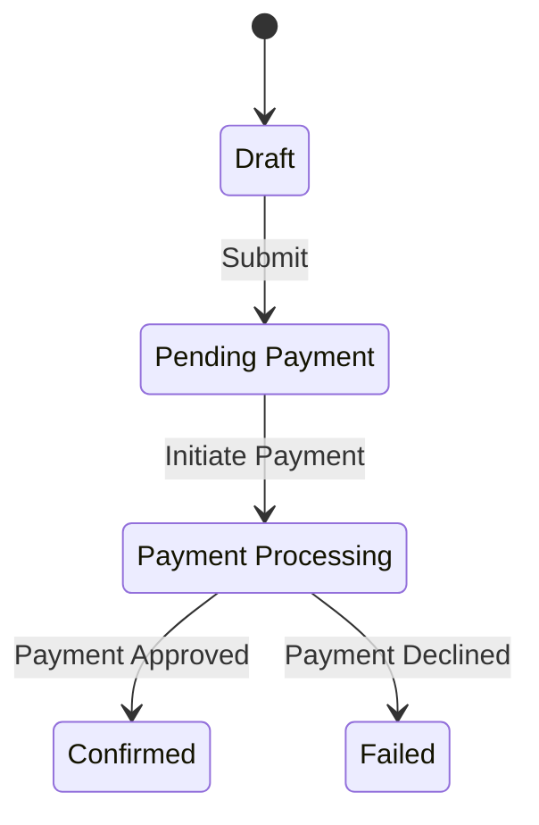

## Transitions

### Basic Transition
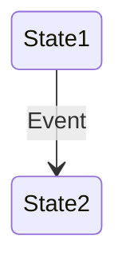

### Transition with Condition
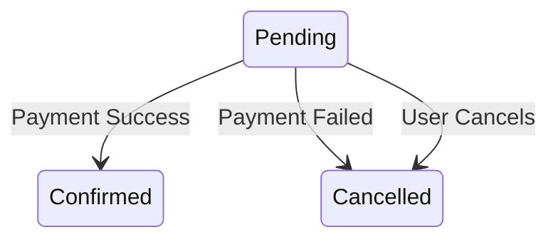

### Self-Transition
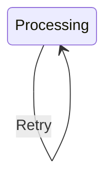

## Composite States

States can contain nested states:

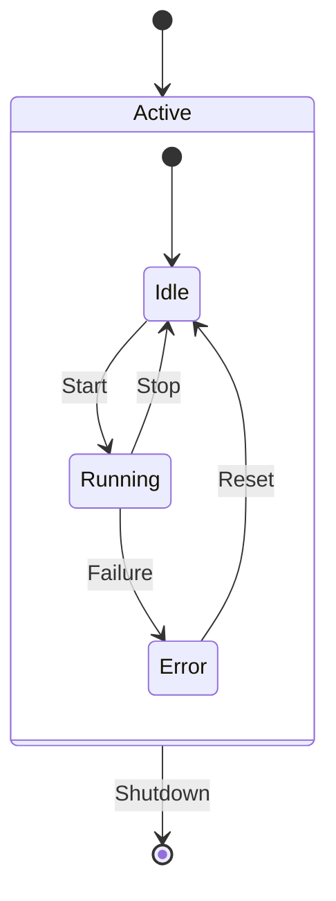

## Concurrent States

Show parallel state machines:

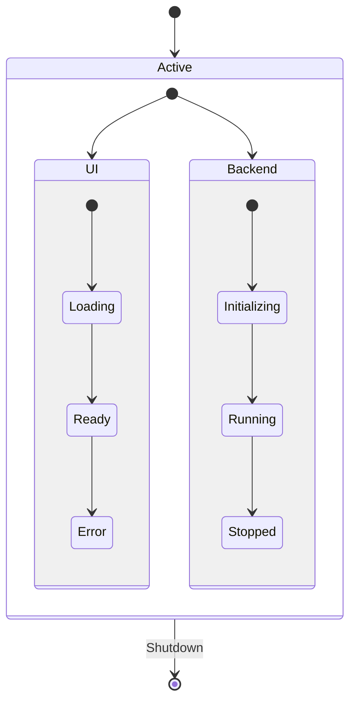

## Notes

Add explanatory notes to states:

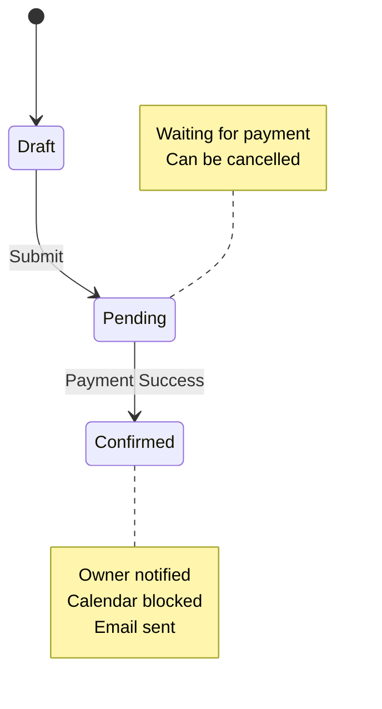

## History States

Remember previous state:

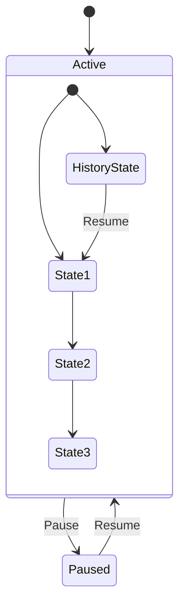

## Choice Points

Add decision logic:

```mermaid
stateDiagram-v2
    [*] --> Processing
    Processing --> Choice1{Valid?}
    Choice1 -->|Yes| Success
    Choice1 -->|No| Error
    Success --> [*]
    Error --> [*]
```

## Fork and Join

Parallel execution:

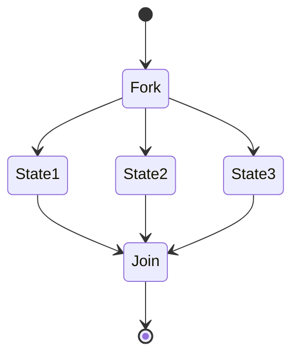

## Comprehensive Example: Order Lifecycle

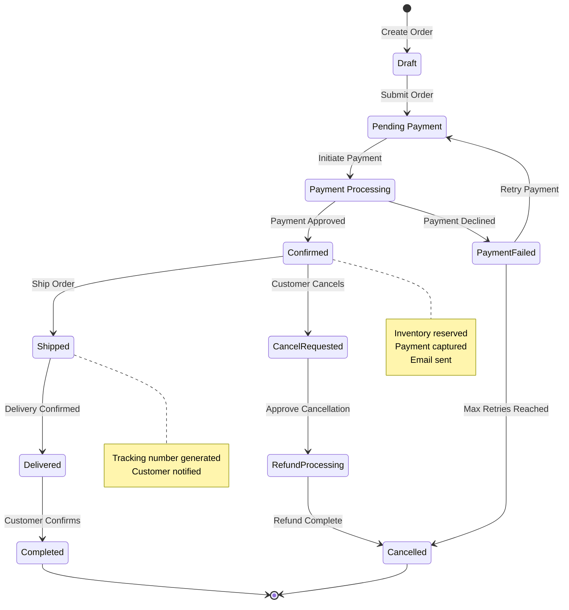

## User Account States

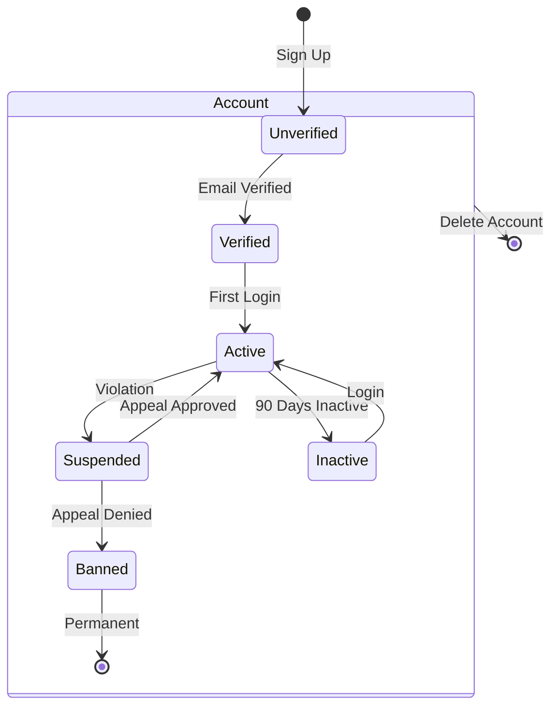

## Workflow Approval States

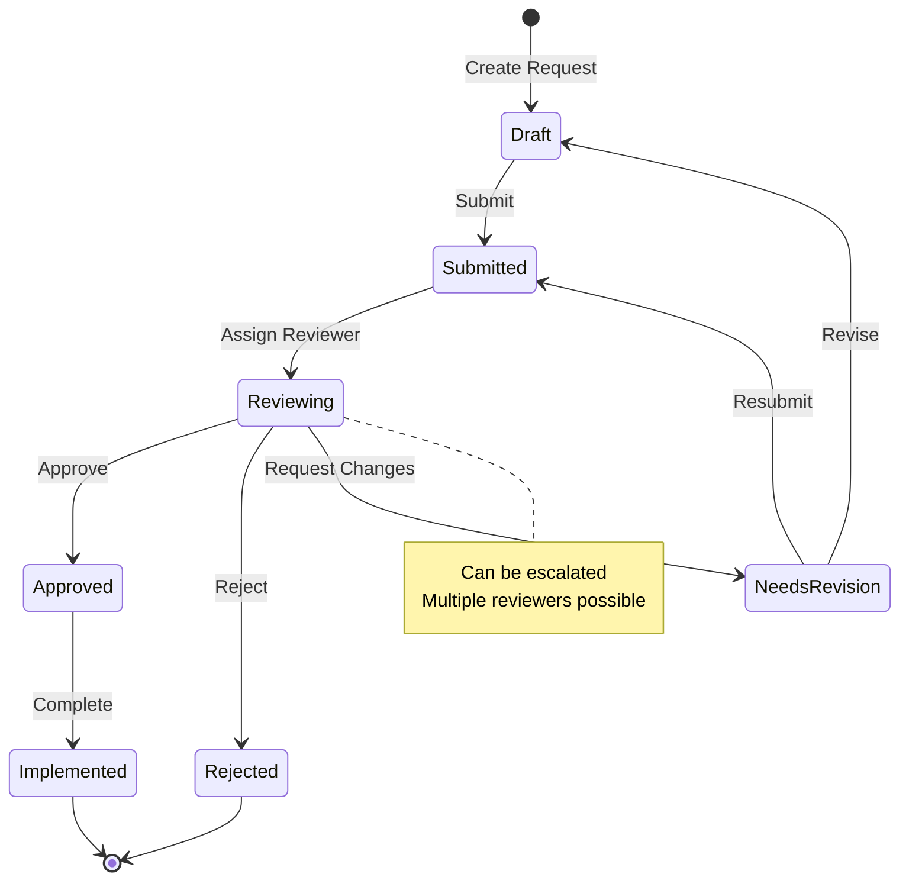

## Best Practices

1. **Clear state names** - Use descriptive, action-oriented names
2. **Show all transitions** - Include error paths and edge cases
3. **Mark terminal states** - Use `[*]` for start and end
4. **Add notes** - Explain complex states or important behaviors
5. **Group related states** - Use composite states for organization
6. **Show conditions** - Label transitions with triggering events
7. **Avoid deep nesting** - Keep state hierarchies manageable

## Common Use Cases

- **Order/Booking Lifecycles** - Track status through workflow
- **User Account States** - Authentication and account status
- **Document Workflows** - Approval and review processes
- **System States** - Application lifecycle (starting, running, stopping)
- **Process States** - Multi-step processes with checkpoints
- **Entity Lifecycles** - Creation, modification, deletion states
