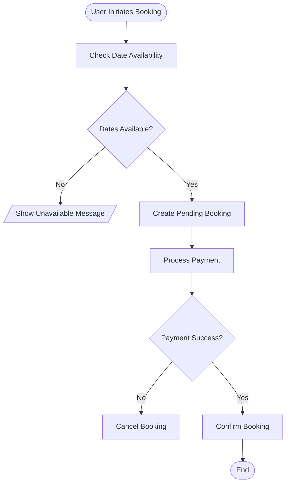
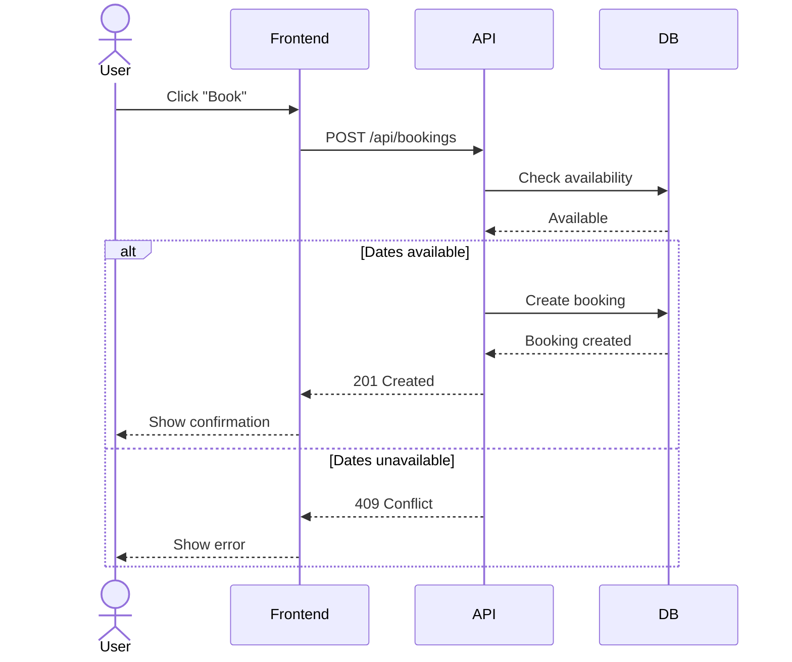
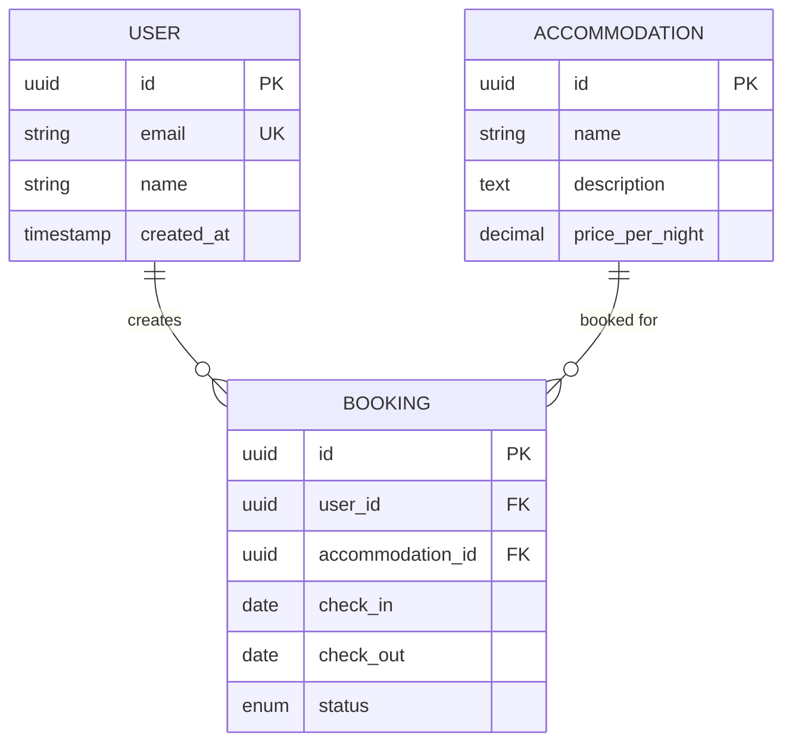
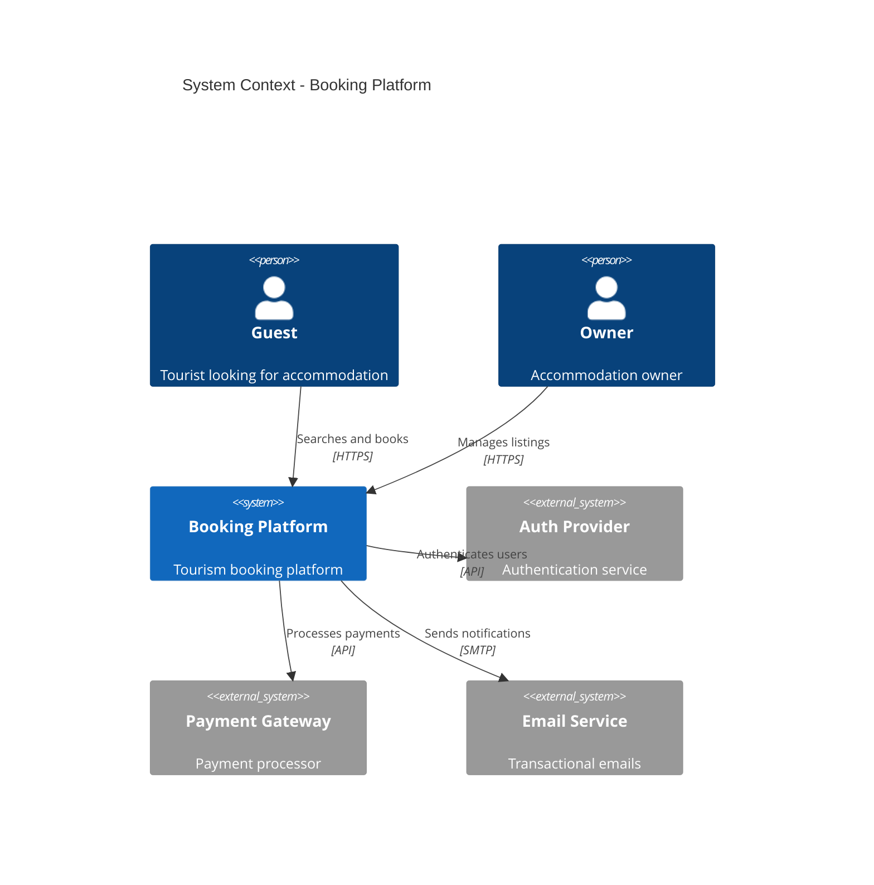
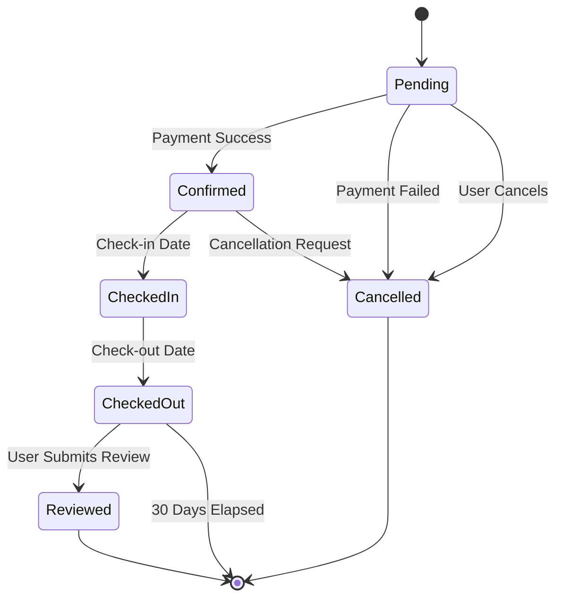
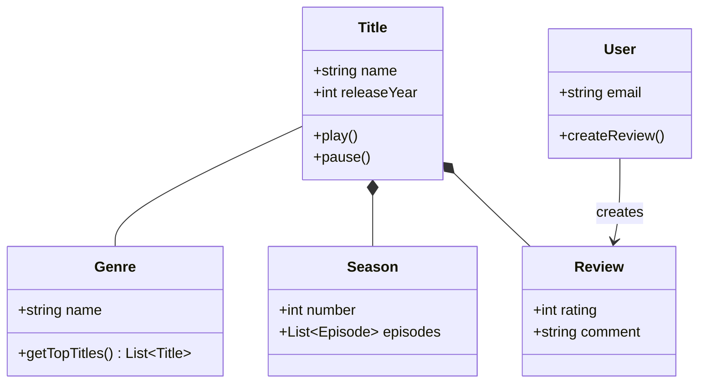

# Mermaid Diagram Workflows

Step-by-step workflows for creating different types of diagrams with validation checklists.

## Workflow: Creating a Flowchart

### Step 1: Identify the Process
- [ ] Define start and end points
- [ ] List all process steps
- [ ] Identify decision points
- [ ] Map all possible paths

### Step 2: Choose Direction
- `TD` (Top Down) - Default, most common
- `LR` (Left Right) - For wide processes
- `BT` (Bottom Top) - Rare, for reverse flows
- `RL` (Right Left) - Rare, for RTL languages

### Step 3: Map Nodes and Shapes
- `([Rounded])` - Start/End nodes
- `[Rectangle]` - Process steps
- `{Diamond}` - Decision points
- `[/Parallelogram/]` - Input/Output
- `[(Database)]` - Data storage
- `((Circle))` - Connectors

### Step 4: Connect with Arrows
- `-->` - Standard flow
- `-->|Label|` - Labeled path
- Use labels on decision branches

### Step 5: Validate
- [ ] All paths lead to an end
- [ ] Decision points have all outcomes covered
- [ ] Labels are clear and descriptive
- [ ] Flow direction is logical

**Example:**

## Workflow: Creating a Sequence Diagram

### Step 1: Identify Participants
- [ ] List all actors (users, external systems)
- [ ] List all system components (services, APIs, databases)
- [ ] Order left-to-right by interaction sequence

### Step 2: Define Message Flow
- [ ] Identify first message/trigger
- [ ] Map request/response pairs
- [ ] Add error paths
- [ ] Include async messages if needed

### Step 3: Use Appropriate Arrow Types
- `->>` - Synchronous request (solid arrow)
- `-->>` - Response/return (dotted arrow)
- `-)` - Async message (open arrow)
- `--)` - Async response (open dotted)

### Step 4: Add Control Flow
- `alt/else/end` - Alternative paths
- `loop/end` - Repetitive operations
- `opt/end` - Optional operations
- `par/end` - Parallel operations

### Step 5: Validate
- [ ] All participants identified
- [ ] Message flow is logical
- [ ] Return messages shown where needed
- [ ] Alt/loop blocks properly closed

**Example:**

## Workflow: Creating an ERD

### Step 1: Identify Entities
- [ ] List all tables/entities
- [ ] Group related entities
- [ ] Identify core vs. supporting entities

### Step 2: Define Attributes
- [ ] List all columns for each entity
- [ ] Identify data types
- [ ] Mark primary keys (PK)
- [ ] Mark foreign keys (FK)
- [ ] Mark unique constraints (UK)

### Step 3: Map Relationships
- [ ] Identify all relationships between entities
- [ ] Determine cardinality:
  - `||--||` - One to one
  - `||--o{` - One to many
  - `}o--o{` - Many to many
  - `||--o|` - One to zero or one

### Step 4: Add Relationship Labels
- [ ] Add descriptive labels (e.g., "creates", "belongs to")
- [ ] Use clear, action-oriented verbs

### Step 5: Validate
- [ ] All entities have attributes defined
- [ ] Relationships are accurate
- [ ] Cardinality matches actual data model
- [ ] Primary/Foreign keys correctly marked

**Example:**

## Workflow: Creating a C4 Diagram

### Step 1: Choose Level
- **Context** - System and external actors/systems
- **Container** - Applications and data stores within system
- **Component** - Internal structure of containers

### Step 2: Identify Elements
- **Context**: People, systems (internal/external), relationships
- **Container**: Web apps, APIs, databases, services
- **Component**: Modules, services, libraries within container

### Step 3: Use Correct Element Types
- `Person()` - Human users
- `System()` - Internal systems
- `System_Ext()` - External systems
- `Container()` - Applications/services
- `ContainerDb()` - Databases
- `Component()` - Internal components

### Step 4: Define Relationships
- Use `Rel()` to connect elements
- Add protocol/technology labels (e.g., "HTTPS", "API", "SQL")
- Show direction of data flow

### Step 5: Validate
- [ ] Appropriate level selected for audience
- [ ] All systems/containers shown
- [ ] Relationships clear and labeled
- [ ] External systems identified

**Example (Context):**

## Workflow: Creating a State Diagram

### Step 1: Identify States
- [ ] List all possible states
- [ ] Group related states
- [ ] Identify initial state
- [ ] Identify terminal states

### Step 2: Map Transitions
- [ ] Identify all state transitions
- [ ] Determine triggers for each transition
- [ ] Map error/exception paths
- [ ] Identify loops (states that can return to themselves)

### Step 3: Add Transition Labels
- [ ] Use clear, action-oriented labels
- [ ] Include conditions if needed
- [ ] Show both success and error paths

### Step 4: Add Notes (Optional)
- [ ] Add notes for complex states
- [ ] Explain side effects or important behaviors
- [ ] Document state entry/exit actions

### Step 5: Validate
- [ ] All states defined
- [ ] Transitions are logical and complete
- [ ] Start state marked with `[*]`
- [ ] Terminal states marked with `[*]`
- [ ] No unreachable states

**Example:**

## Workflow: Creating a Class Diagram

### Step 1: Identify Classes
- [ ] List all classes/entities
- [ ] Group by domain/package
- [ ] Identify core vs. supporting classes

### Step 2: Define Class Members
- [ ] List attributes with types
- [ ] List methods with parameters and return types
- [ ] Use visibility modifiers: `+` public, `-` private, `#` protected

### Step 3: Map Relationships
- `--` - Association (loose relationship)
- `*--` - Composition (strong ownership)
- `o--` - Aggregation (weak ownership)
- `<|--` - Inheritance (is-a relationship)
- `-->` - Dependency (uses)

### Step 4: Add Multiplicity
- `1` - Exactly one
- `*` - Zero or more
- `1..*` - One or more
- `0..1` - Zero or one

### Step 5: Validate
- [ ] All classes have members defined
- [ ] Relationships are accurate
- [ ] Multiplicity matches actual design
- [ ] Inheritance hierarchy is correct

**Example:**

