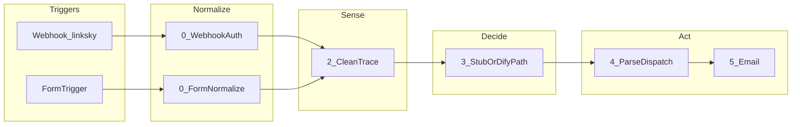

# n8n 工作流需求规格（单页）

本文件把业务意图压成 **n8n 可执行契约**：触发方式、数据形状、分支、失败语义、验收与 MCP 改法边界。  
**工具链、巡检 API、硬红线细则** 以维护手册为准，勿在此重复粘贴长文：

| 主题 | 维护手册 |
|------|----------|
| 标准调用链、SDK 修改、测试 pin | [§1 标准调用链](docs/n8n-mcp-workflow-guide.md#1-标准调用链) · [§1.4 测试](docs/n8n-mcp-workflow-guide.md#14-测试) |
| 安全准则、SDK 重建边界、激活 | [§2 安全准则](docs/n8n-mcp-workflow-guide.md#2-安全准则修改前必读) · [§2.2 SDK 重建的边界](docs/n8n-mcp-workflow-guide.md#22-sdk-重建的边界) · [§2.3 激活](docs/n8n-mcp-workflow-guide.md#23-激活状态) |
| 常见问题（表达式、Switch、数据倍增） | [§3 常见问题模式](docs/n8n-mcp-workflow-guide.md#3-常见问题模式) |
| `$env` 审计与 Variables | [§3.6](docs/n8n-mcp-workflow-guide.md#36-实例级-env-与-n8n_block_env_access_in_node) |
| 回答用户的输出顺序 | [§5 输出沟通风格](docs/n8n-mcp-workflow-guide.md#5-输出沟通风格) |
| 错误分类、硬红线、巡检、errorWorkflow | [§6.3](docs/n8n-mcp-workflow-guide.md#63-错误分类与处理策略) · [§6.4](docs/n8n-mcp-workflow-guide.md#64-巡检话术) · [§6.6](docs/n8n-mcp-workflow-guide.md#66-挂错误工作流到业务工作流) |
| 备份与恢复 | [docs/backup-sop.md](docs/backup-sop.md) |
| 写作惯例、链路透视、历史规则取舍（`F:\C\workflow` 沉淀） | [docs/agent-context-from-workflow-drive.md](docs/agent-context-from-workflow-drive.md) |

---

## 1. 北极星与反目标

**北极星（一句话、可观测）**  
> Webhook 或人工表单上报带图 JSON 后，在可接受时延内完成清洗、研判（Dify 或占位）、解析分发，并发出邮件（及可选 MQTT）；每条执行可通过 **`_trace_id`** 与 **`_execution_id`** 在邮件与执行历史中对照。

**反目标（明确不做）**  
- 不在本工作流内持久化原始密钥；不依赖节点内 **`$env`**（实例启用 `N8N_BLOCK_ENV_ACCESS_IN_NODE` 时）；不在未授权时写入 `workflow_errors` 以外的业务库。  
- 不自动修改 `fixxxxxx` / `workflow-backup-bot` 本体（项目硬红线）。

---

## 2. 触发与幂等（TriggerContract）

| 项 | 填写 |
|---|------|
| 触发类型 | **Webhook**（`1.接收端` POST `.../webhook/linksky`）与 **Form**（`人工报送表单`）双入口，汇合至 `2.清洗与溯源层` |
| 入口 URL 或 Cron | Webhook path：`linksky`（以实例 `webhookId` 为准）；Form 由 n8n 托管表单 URL |
| 是否允许重复投递 | **允许**；无服务端去重键；下游应幂等处理副作用（邮件重复投递风险由业务接受或后续加去重） |
| 并发与顺序预期 | 默认可并行多条执行；单条内顺序执行 |
| 激活后预期 | 上线前 **`active: true`**；API 整包更新后需在 UI 确认激活与触发器 |
| Error workflow | **已挂** `settings.errorWorkflow` = `s09Ca5mbYGIePvBK`（`fixxxxxx`） |

**实例变量（迁移自 `$env`，在 n8n Settings → Variables 配置）**  

| 变量名 | 用途 |
|--------|------|
| `WEBHOOK_LINKSKY_TOKEN` | `0.Webhook鉴权与标准化` 与请求头 `X-Link-Sky-Token` 比对 |

未配置时：若变量为空，Webhook 分支**不校验**令牌（与旧逻辑「未设置 env 则跳过校验」一致）；生产环境**必须**配置。

---

## 3. 数据契约（DataContract）

### 3.1 入口 payload（Webhook body，最小逻辑形状）

```json
{
  "object_type": "人员跌倒 (FALL)",
  "location": "连云港职院-核心防区",
  "confidence": "0.92",
  "device_id": "cam-01",
  "timestamp": 1715689600000
}
```

必填：`object_type`, `location`（清洗层会对缺省填「未知」）；**二进制**：须带图片（`binary.data` 或单附件键）。  
禁止 / 不得记录字段（合规）：原始 **`X-Link-Sky-Token`** 值不入 `workflow_errors` 正文；不落库完整身份证号、银行卡等（本流当前无此类字段）。

### 3.2 关键中间态

- **`_trace_id`**：在 `2.清洗与溯源层` 生成，形如 `lsky_<ms>_<seq>`，贯穿 `dify_inspection_data` 文案、下游 JSON、邮件。  
- **`_execution_id`**：n8n 执行 ID，在 `2.清洗与溯源层` 写入，在 `4.数据解析分发` 与 **`5.发送预警邮件`** 主题/正文中输出。  
- **`dify_inspection_data`**：送入 Dify 的文本摘要（含 trace 片段）。  
- **占位分支**：`3.Dify跳过_占位研判` 仅返回 `answer` 等字段；`4` 仍从 `$('2.清洗与溯源层')` 取 `_trace_id` / `_execution_id`。

### 3.3 出口或对外副作用

- **邮件**（`5.发送预警邮件`）：HTML + 主题含 `object_type`, `risk_level`, `_trace_id`, `_execution_id`。  
- **MQTT**（`MQTT`）：默认禁用；启用后消费 `4` 的输出。  
- **Dify**：`上传图片到Dify` + `3.Dify智能研判` 使用凭证 **`安防DIFY-TEST`**（Header Auth）；默认主链可走占位，Dify 链由禁用手动锚点挂线（见仓库 `scripts/agis-dual-rail-dify.mjs` 说明）。  
- **成功判据**：执行无未捕获错误；邮件节点成功；Dify 链成功时返回体含预期 `answer` 结构（由 `4` 解析 Markdown 内 JSON）。

---

## 4. 控制流草图（ControlFlow）



双轨（占位 / Dify）以**画布连线**切换为主，不用 IF；详见 `scripts/agis-dual-rail-dify.mjs` 头部注释。

---

## 5. 失败语义（FailureContract）

| 失败类型 | 可自动重试 | 必须人工 | 期望 error_category（粗） | 备注 |
|----------|------------|----------|----------------------------|------|
| Dify / CDN 504、网络抖动 | HTTP 节点已配 `maxTries` + `waitBetweenTries` | 长期需换线路/自建/异步 | external_network | 见附录 B |
| 429 / quota | | ✓ | external_quota | 加配额或轮换 Key |
| 401/403 凭证 | | ✓ | external_auth | 不通过 MCP 自动改 credentials |
| 鉴权失败 / body 缺失 | | ✓（配置变量） | code_param / unknown | 查 `WEBHOOK_LINKSKY_TOKEN` Variables |
| JSON 解析失败（`4`） | | 视情况 | code_json | 上游 `answer` 格式 |

是否写入 `workflow_errors`：依赖 **`fixxxxxx`** 与业务流 **`errorWorkflow`** 挂载；见手册 §6。  
**建议（人工增强可观测性）**：在错误采集写入 `notes` 时，若执行上下文可取，附加 **`_trace_id` / `_execution_id`** 文本，便于与邮件、Dify 日志对齐（**不**改 `fixxxxxx` 自动化逻辑时由运维在巡检回写时粘贴）。

---

## 6. MCP / SDK 可行性条（FeasibilityStrip）

| 检查项 | 是 / 否 |
|--------|---------|
| 节点总数 > 30 | **否**（约 13） |
| 多个长 system prompt 的 AI Agent | **否**（HTTP + Code 为主） |
| 需要改节点 `id` / `type` / `typeVersion` / `position` | **否**（常规维护） |
| 需要改 `connections` 拓扑 | **仅**双轨切换时由人在 UI 改线 |
| 需要动 `credentials` | **否**（除非轮换 Dify Key） |
| 涉及 `fixxxxxx` 或 `workflow-backup-bot` 本体 | **否** |

**结论**：可走 **整包 GET → 脚本/补丁 → PUT**（与 `scripts/apply-agis-spec-batch.mjs` 同类）；大段 Agent prompt 重建时用 UI。

---

## 7. 验收场景（Acceptance）

1. **Given** 已在 Variables 配置 `WEBHOOK_LINKSKY_TOKEN`，**When** POST Webhook 且 Header 正确、body+binary 合法，**Then** 执行成功且邮件主题/正文同时出现与执行记录一致的 **`_trace_id`** 与 **`_execution_id`**。  
2. **Given** Header 错误或未配置变量且已配置非空 token，**When** POST，**Then** 鉴权节点抛错，且（若已挂 errorWorkflow）错误进入采集队列。  
3. **Given** 占位链接通（`2 → 3.Dify跳过_占位研判 → 4`），**When** 表单或 Webhook 完整上报，**Then** `4` 输出 `risk_level` 等字段且 **`_trace_id`** 与清洗层一致。  
4. **Given** Dify 链在画布上接通且账户可用，**When** 走上传+研判，**Then** `4` 解析出三键中文 JSON 语义且不丢失 **`_execution_id`**。

---

## 8. OpenQuestions（缺口清单）

- [ ] 是否在入口增加业务层 **`idempotency_key`** 防邮件重复（产品决策）。  
- [ ] Dify 长期走 SaaS 还是自建（见附录 B）。  
- [ ] 生产是否强制 Variables 非空以关闭「未配置 token 则跳过校验」行为。

---

## 9. Agent 工作协议（读此文件后执行）

1. 用户说 **`plan`** / 「对齐需求」：必须先走 [`docs/agent-skills-routing.md`](docs/agent-skills-routing.md)（**brainstorming** 澄清 → 回填本文件空白 → **writing-plans** / **01-plan** 出路径）；产出写入 `tmp/plans/`，**不**改 n8n。  
2. 用户说 **`go`** / **`fix`**：按 routing 执行或修复；以本文件 **验收场景** 为完成判据之一。  
3. 读取 frontmatter 与本规格凡空白处 → 汇总进 **OpenQuestions**。  
4. 未获 **`go`** / **`fix`** 授权前，不对 n8n 执行 `update_workflow` / `create_workflow_from_code` 等写操作。  
5. 排查与回复顺序遵循 [§5](docs/n8n-mcp-workflow-guide.md#5-输出沟通风格)。  
6. 硬红线与巡检闭环以维护手册 [§2](docs/n8n-mcp-workflow-guide.md#2-安全准则修改前必读)、[§6.3](docs/n8n-mcp-workflow-guide.md#63-错误分类与处理策略) 与 `CLAUDE.md` 为准。

---

## 附录 A：运维脚本索引

| 脚本 | 作用 |
|------|------|
| [scripts/audit-n8n-env-in-workflows.mjs](scripts/audit-n8n-env-in-workflows.mjs) | 全实例扫描工作流 JSON 中的 `$env.` |
| [scripts/apply-agis-spec-batch.mjs](scripts/apply-agis-spec-batch.mjs) | 空地联勤：Variables 鉴权、trace/execution 贯通 |
| [scripts/apply-telemetry-probe-workflow.mjs](scripts/apply-telemetry-probe-workflow.mjs) | 遥测探针 Webhook：对齐 Guard 与 `$vars` |
| [scripts/agis-dual-rail-dify.mjs](scripts/agis-dual-rail-dify.mjs) | 双轨占位/Dify 拓扑与占位文案 |

工作流字母简称（巡检/排查）：[`docs/workflow-aliases.md`](docs/workflow-aliases.md)（与根目录 `CLAUDE.md` 中「巡检@」「排查@」触发词联动）。

**安防总项目编排**（任务书地图、集成顺序）：[`docs/project-docs/ANFANG-PROGRAM-MASTER.md`](docs/project-docs/ANFANG-PROGRAM-MASTER.md)。

---

## 附录 B：Dify 与上游韧性（504 / 配额）

| 手段 | 说明 |
|------|------|
| 已做 | HTTP **`maxTries`**、**`waitBetweenTries`**（秒级间隔避 Cloudflare）、**缩短 query**、**timeout** |
| 充值 / 配额 | 429、`external_quota` 只能加资源或降频，勿堆无限重试 |
| 自建 Dify | 将 `api.dify.ai` 换内网 endpoint，降公网 CDN 不确定性 |
| 异步研判 | Webhook **先 ACK**，研判由队列 + 回调第二条工作流完成（需改产品与触发器，属架构级） |
| 观测 | 上传与 chat **分两节点**，错误采集按 **`node_name`** 区分归因 |

---

## 附录 C：虚构示例（Few-shot，勿当生产配置）

以下为演示如何写满一格；数据为编造。

```yaml
# 仅作示例 — 勿合并进上方正式 frontmatter
workflow_name: "demo-order-webhook"
workflow_id: "wf_xxx_placeholder"
owner: "team-platform"
status: draft
last_reviewed: "2026-05-13"
```

**北极星**：客户系统在订单支付成功后 POST 本工作流，30 秒内写入内部「待发货」表并返回 `202` 与 `{ "accepted": true }`。  
**反目标**：不负责退款、不负责改价、不存完整卡号。
